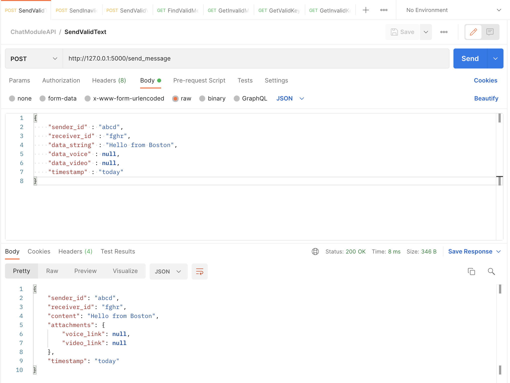
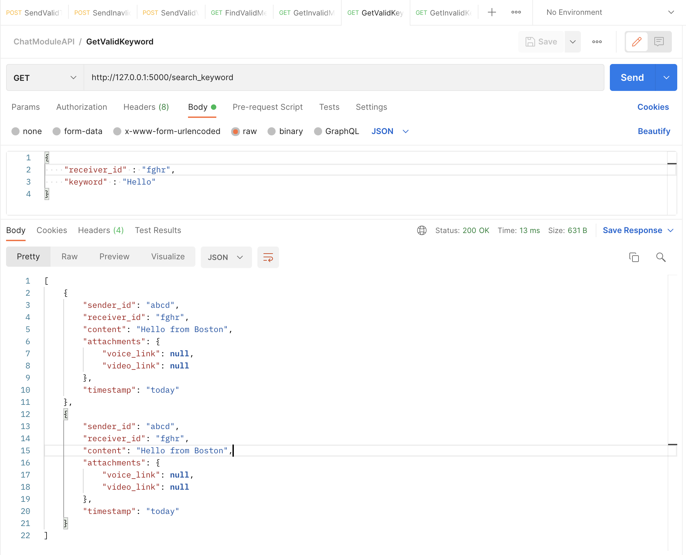
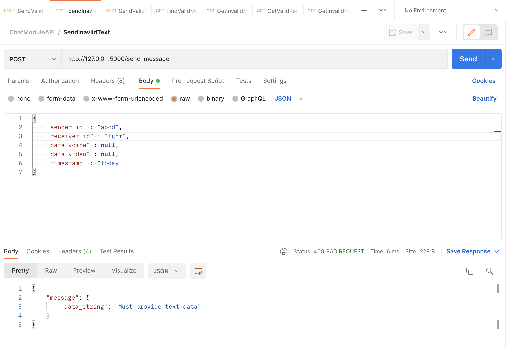
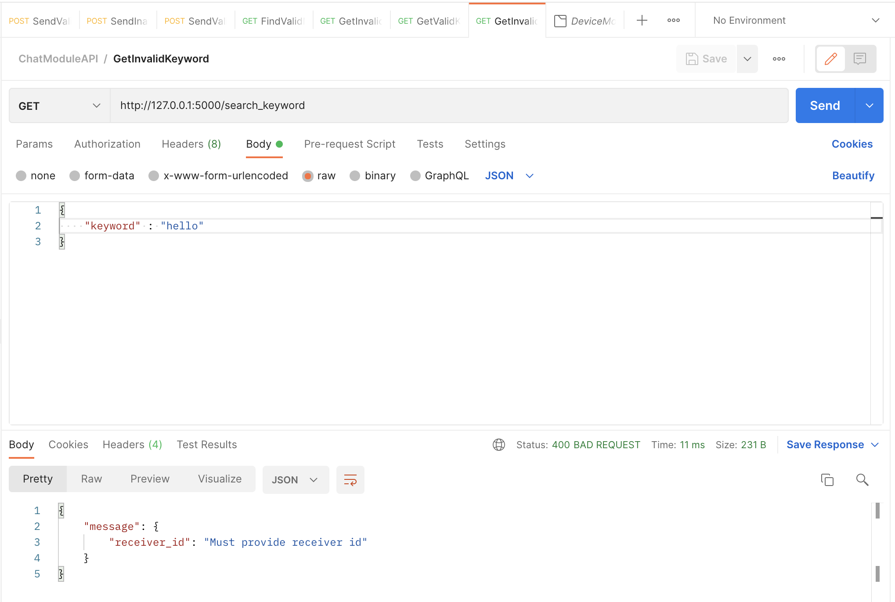
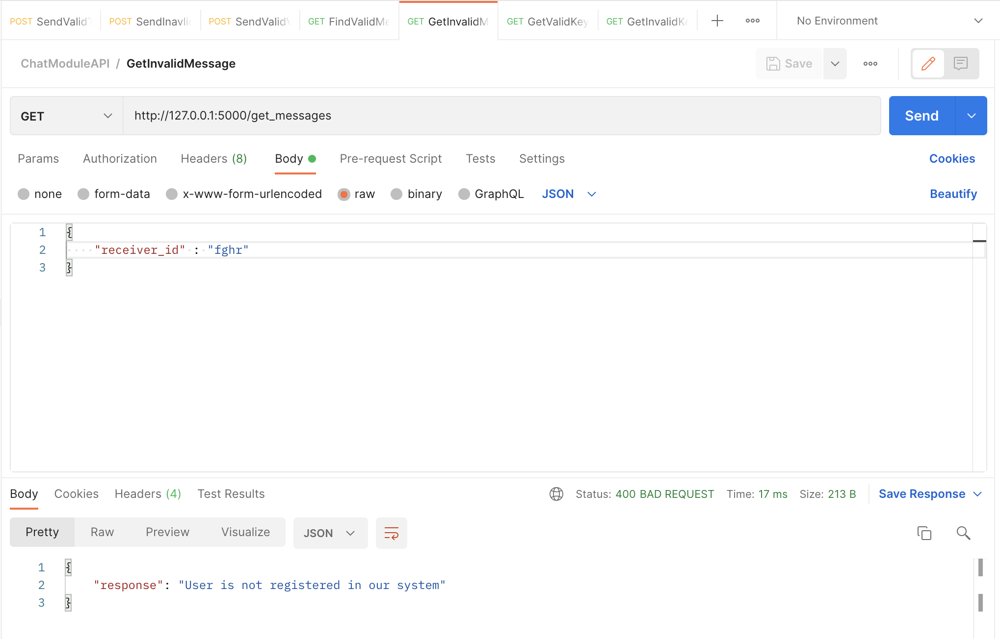
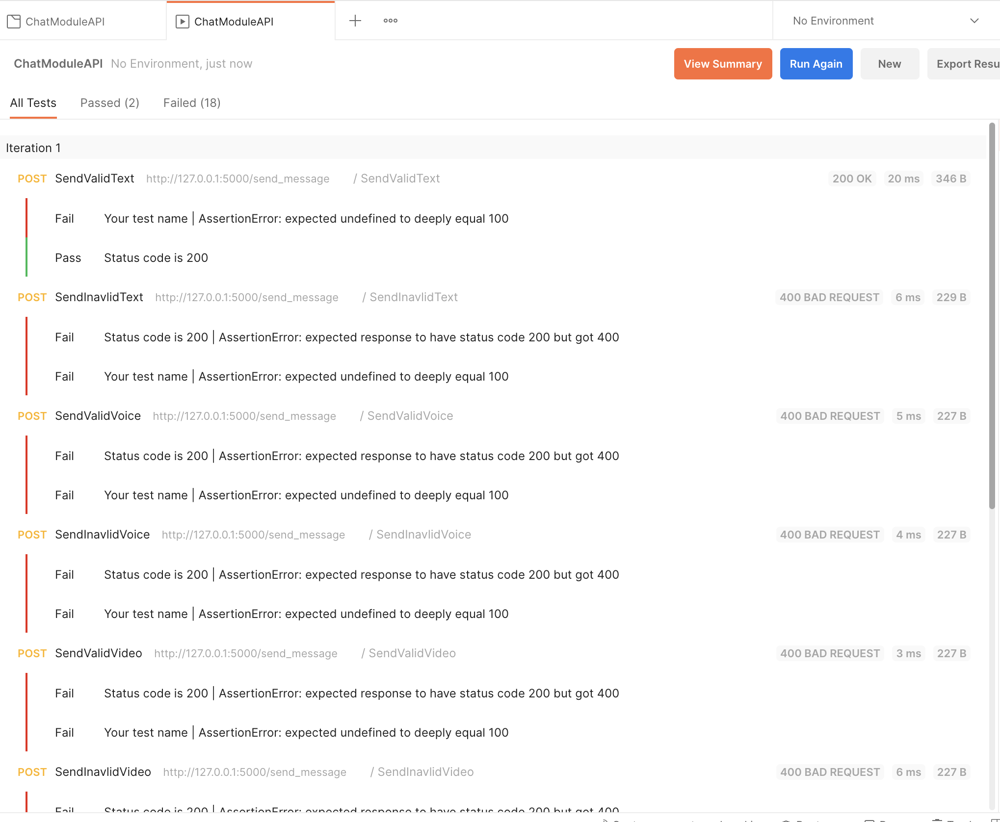

# Testing my API with Postman GUI
This file describes my organization, automation, and results from testing performed with the Postman application.

I have created a collection inside the Postman GUI for the DEVICE module. Under this collection I saved the unit tests for the DEVICE API calls. 

## Individual Requests Test
I am able to test each request separately and see the response in the console as well as the status code. 

I have built as least two unit tests for each API method. 

*In the above image we can see a valid request to send a message. The return value is a json that confirms the information uploaded to the database*

*In the above image we can see an Valid request to filter messages through a keyword. This returns any entries in the messages database for which the content of the text message contains that keyword and belongs to the receiver id given as input*

*In the above picture we can see an example of an invalid request to send a new message and the return string that tells the sender why it was not successful*

*In the above picture we can see an example of an invalid request to find messages with a given keyword and the return string that tells the sender why it was not successful*

*In the above picture we can see an example of an invalid request to find messages and the return string that tells the sender why it was not successful*

## Testing Automation with Postman 

Postman has the ability to run all the requests in a collection for as many iterations as I would like. For this Postamn will run my requests and tell me what it returns; but also there needs to be TESTS added to the collection. These tests are scripts that postman runs for each request and can be modified to test for various things. As of now I am using their scripts templates to check that all my request return 200 OK response. 

In the below image we can see how Postman organizes the results from these tests. This is somehow similar to Github Actions workflow and I will be exploring more to see if there are ways to automate this even further by maybe integrating it with my push commands on the Github Repo. 

